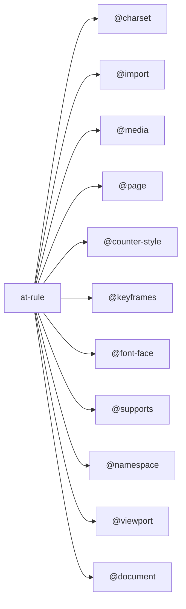

## 浏览器排版

URL -> HTML - DOM -> <b>DOM with css </b> -> <b>DOM with position</b>

1. 根据前面计算好dom树,使用flex布局,将收集好的元素逐一放进计算好的位置
2. 使用images插件,递归调用子元素的绘制方法,最终合成一张位图

## CSS grammar

### at-rule

由一个@关键字和后续的一个区块组成 以分号结束 【eg: @charset;】

> 如无法正常预览以下思维导图，chrome浏览器可以在应用商店下载安装 <b>github-mermaid</b> 扩展程序



#### @charset

提示css文件使用的字符编码方式，必须出现在css文件的开头，只会在语法解析阶段前使用

```code
@charset "utf-8";
```

#### @import
用于引入css文件，但必须在其他（除了@charset）at-rule和其他样式规则之前，否则不生效

```code
@import "a.css";
or
@import url("b.css");

@import [ <url> | <string> ]
        [ supports( [ <supports-condition> | <declaration> ] ) ]?
        <media-query-list>? ;
```

后面再展开补充

#### @media
媒体查询，条件组规则中的条件（The @media rule is a conditional group rule whose condition is a media query.）

```code
@media screen and (min-width: 264px),
	print and (min-width: 760p) {
		#section_navigation {
			flaot: left;
		}
	}

@media <media-query-list> {
  <stylesheet>
}
```
#### @page
分页媒体访问页面时的表现设置，是一种特殊的盒子模型，除了本身外还可以设置周围的盒子， 没有选择器列表时应用到其他页面，page选择器后面可以跟page类型选择器或者page伪类
```code
@page {
	@top-left {
	}
	@buttom-center {
	}
}
@page :left {
	margin-left: 3cm;
	margin-right: 4cm;
}
@page:first {}


@page = @page <page-selector-list>? { <declaration-list> }
<page-selector-list> = <page-selector>#
<page-selector> = [ <ident-token>? <pseudo-page>* ]!
<pseudo-page> = ':' [ left | right | first | blank ]

/* Margin rules */
@top-left-corner = @top-left-corner { <declaration-list> };
@top-left = @top-left { <declaration-list> };
@top-center = @top-center { <declaration-list> };
@top-right = @top-right { <declaration-list> };
@top-right-corner = @top-right-corner { <declaration-list> };
@bottom-left-corner = @bottom-left-corner { <declaration-list> };
@bottom-left = @bottom-left { <declaration-list> };
@bottom-center = @bottom-center { <declaration-list> };
@bottom-right = @bottom-right { <declaration-list> };
@bottom-right-corner = @bottom-right-corner { <declaration-list> };
@left-top = @left-top { <declaration-list> };
@left-middle = @left-middle { <declaration-list> };
@left-bottom = @left-bottom { <declaration-list> };
@right-top = @right-top { <declaration-list> };
@right-middle = @right-middle { <declaration-list> };
@right-bottom = @right-bottom { <declaration-list> };
```
#### @keyframes
动画关键帧

```code
@keyframes move {
	from {}
	to {}
}

@keyframes = @keyframes <keyframes-name> { <rule-list> }

<keyframes-name> = <custom-ident> | <string>

<keyframe-block> = <keyframe-selector># { <declaration-list> }

<keyframe-selector> = from | to | <percentage>
```
#### @font-face
字体定义

```code
@font-face {
  font-family: Gentium;
  src: url(http://example.com/fonts/Gentium.woff);
}
```
#### @supports

跟 [@media](https://www.w3.org/TR/css3-conditional/) 类似

> 这段代码 是支持 displace：flexbox 特性才会生效

```code
@supports ( display: flexbox ) {
  body, #navigation, #content { display: flexbox; }
  #navigation { background: blue; color: white; }
  #article { background: white; color: black; }
}
```
> @support也可以作为可选项，当不支持 display: flexbox 特性时

```code
@supports not ( display: flexbox ) {
  body { width: 100%; height: 100%; background: white; color: black; }
  #navigation { width: 25%; }
  #article { width: 75%; }
}
```
> 下面这段代码，检查了对 box-shadow属性的支持情况，包括它的前缀的支持情况，如果支持，则会指定 box-shadow（带有前缀）和color， 如果box-shadow不支持，文本就会消失

```code
@supports ( box-shadow: 2px 2px 2px black ) or
          ( -moz-box-shadow: 2px 2px 2px black ) or
          ( -webkit-box-shadow: 2px 2px 2px black ) or
          ( -o-box-shadow: 2px 2px 2px black ) {
  .outline {
    color: white;
    -moz-box-shadow: 2px 2px 2px black;
    -webkit-box-shadow: 2px 2px 2px black;
    -o-box-shadow: 2px 2px 2px black;
    box-shadow: 2px 2px 2px black; /* unprefixed last */
  }
}
```
#### @namespace

css选择器会带上特定的命名空间

```code
  @namespace "http://www.w3.org/1999/xhtml";
  @namespace svg "http://www.w3.org/2000/svg";

  namespace
    : NAMESPACE_SYM S* [namespace_prefix S*]? [STRING|URI] S* ';' S*
    ;
  namespace_prefix
    : IDENT
    ;
```
> Q|elem 和 lq|elem 在css文件中都会匹配到<qml:elem>, 但qml|elem 就不行，因为css namespace 只会识别在css中声明的前缀，而不能识别文档语言中声明的前缀

```code
@namespace Q "http://example.com/q-markup";
@namespace lq "http://example.com/q-markup";

<qml:elem xmlns:qml="http://example.com/q-markup"></qml:elem>
```

#### @viewport

设置视口的一些特性

### qualified rule

字面意思是合格规则，就是我们平时会用的css，由选择器和属性指定构成的规则

#### combination

- Descendant combinator(空格)

后代组合器
> h1 em 会选中h1节点后代中的<b>所有</b>em节点，结果very会变成黄色

```html
<h1>This <span class="myclass">headlineis <em>very</em> important</span></h1>
```
```css
h1 em {
	color: yellow
}
```
- Child combinator (>)

子代组合器
> h1 > span 会选中符合条件的span节点，结果headlineis verygood important会变成黄色

```html
<h1>This <span class="myclass">headlineis <em>very</em> important</span></h1>
```
```css
h1 > span {
	color: yellow
}
```
- Next-sibling combinator (+)

直接后继组合器
> h1 + h2 会选中兄弟节点是h2,结果 brother 会变成黄色

```html
<h1>This <span class="myclass">headlineis <em>very</em> important</span></h1>
<h2>brother</h2>
```
```css
h1 + h2 {
	color: yellow
}
```
- Subsequent-sibling combinator (~)

后继组合器， 区别前面的直接后继选择器它会选中所有符合的条件的后继节点，也就是后继节点跟当前节点拥有同一个父节点

> brother 和 sister 会变成黄色

```html
<h1>This <span class="myclass">headlineis <em>very</em> important</span></h1>
<h2>brother</h2>
<h2>sister</h2>
```
```css
h1 + h2 {
	color: yellow
}
```
-  Column combinator (||)

列组合器，用在table中，表示选中对应列符合条件的单元格

> 浏览器暂不支持