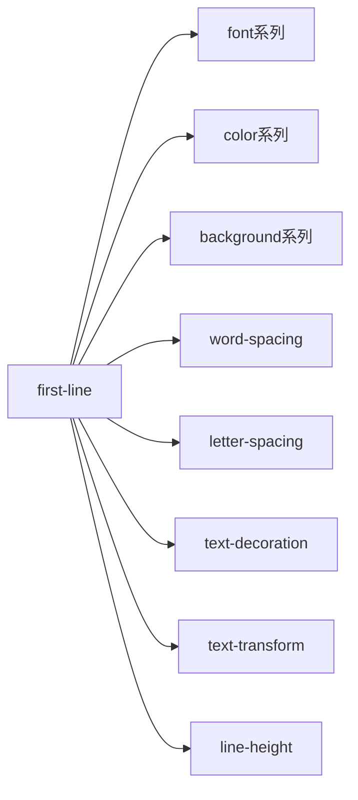
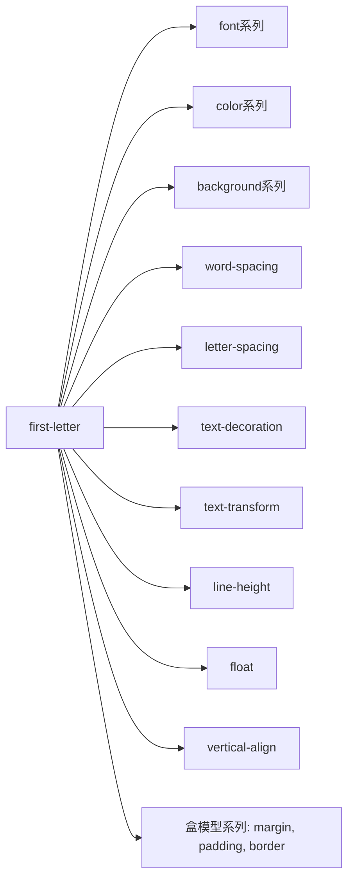

## 优先级

### 优先级算法

Selector: #id div.a#id

Specificity = [0,2,1,1]

S = 0 * N^3 + 2 * N^2 +  1 * N^1 + 1

N = 1000000

S = 200001000001

> practice

**div#a.b .c[id=x]**

- [0,1,3,1]

解释:  [id=x] 属性选择器 = 类选择器

**\#a:not(#b)**

- [0,2,0,0]

解释: :not伪类不参与计算

**\*.a**

- [0,0,1,0]

解释: * 不参与计算

**div.a**

- [0,0,1,1]

## 伪元素

> 为什么first-letter可以设置float, 而first-line不行???

∵ 会脱离文档流,导致无限循环

> 为什么first-line可以设置字体?

∵ 除了line-height 其他属性都是作用在文字上, 没有盒, 排版的时候可以逐个排直到排满

## 盒

分为标准盒(content-box)和ie盒(border-box width = content+padding+border)

#### 正常流排版

分为IFC和BFC

IFC: inline formatting context (方向从左到右)
BFC: block formatting context (方向从上到下)

IFC = inline-box(行里面的盒)
BFC = line-box(inline的element会产生,例如span标签会产生) + block-level-box

#### BFC

定义: 可以容纳新的正常流(从上往下的盒子)

1. 边界重叠

正常流里面block-box设置了overflow: visible,就跟父bfc合并,会产生margin重叠

- block-level 表示可以放入bfc的块级盒子

> 块级盒子指: line-box 和block-level-box,如block,grid,flex,table等

- block-container 表示可以容纳bfc的容器,容器里面都是正常流,只有 **block** 和 **line-block**是

> flex, grid, table 跟与之对应的line-属性都不是block-container, flex中,只有它的一级子元素flex-item才是block-container

- block-box 表示 block-level + block-container
